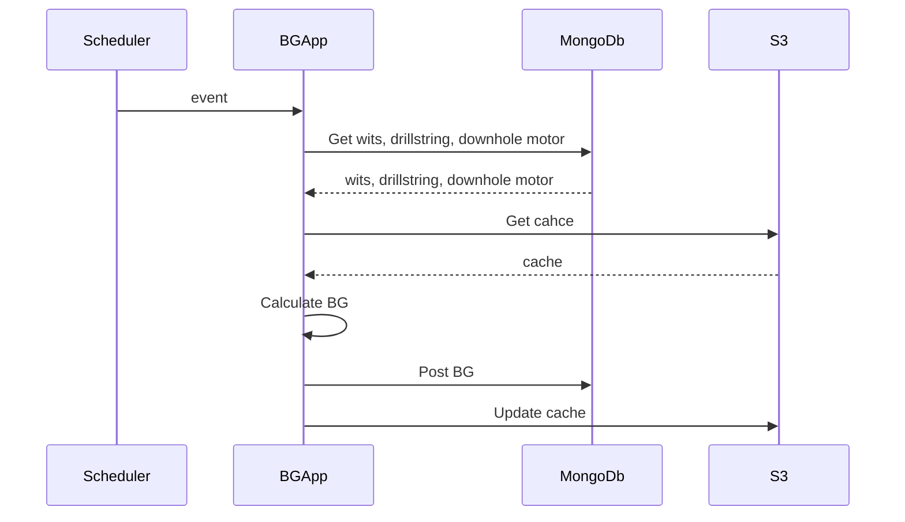
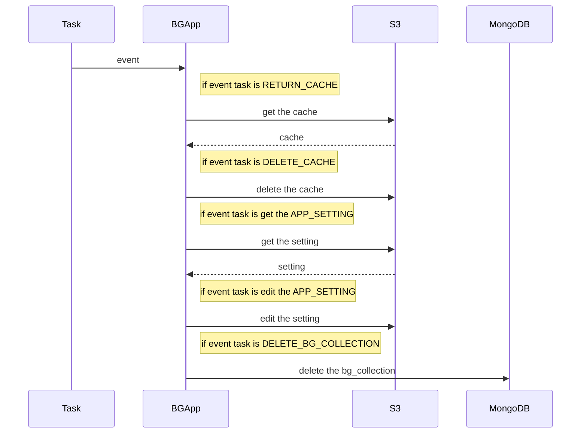

# A realtime PDC bit grade App

In this exercise a realtime PDC bit grade App is developed.

## Data sets

The three data set were made to be used in this exercise App.
Collections are as follows:

* `drillstring` - This is drill sting data.
* `downhole motor data` - This is down-hole motor data.
* `witsml` - This is witsml data which is called wits data in short. 

Initially, data sets are generated through a script and saved locally. The process is then repeated using an Object-Oriented Programming (OOP) approach, providing more flexibility and scalability to demonstrate the difference between the two methods.

For the purpose of this exercise, a dummy API was developed and utilized to simulate a real API. The API offers two methods: one for getting data and another for posting data. The app uses the API to retrieve and send data.

When triggered by an event, the app executes the following calculations:

1. Obtains the start and end timestamps of the event.
2. Uses these timestamps to retrieve wits data from the API.
   1. Parses the wits data based on the wits activity and checks whether all fields are available.
3. Obtains drill string data from the API and parses it.
4. Obtains down-hole motor data from the API and parses it.
5. Groups the wits data by the drillstring ID.
6. Creates a map between the drillstring ID and the downhole motor ID.
7. Obtains the down-hole motor coefficient for each drillstring ID.
8. Calculates the PDC bit grade for each drillstring ID. 
Note that each drill string is considered representative of a new bit.
   1. Flow rate and down-hole motor coefficient are used to calculate the total RPM.
   2. The bit grade equation is as follows:
   3. Bit grade = wob * (rpm + flowrate * motor_cof) / BIT_WEAR_CONSTANT

9. Calculates the cumulative PDC bit grade for each drillstring ID. 
Note that in most cases, there is only one drillstring ID per wits. However, in some cases, there can be two drillstring IDs, and the cumulative PDC bit grade is calculated for each separately.
The app checks the cache and retrieves the latest BG posted for a specific drillstring ID. 
The cache used in this exercise is a simple file stored locally and checked to calculate the BG.
Once the BG is calculated, it is added to the BG collection and posted using the API. In this case, it is saved 
in the local resource folder.

## Deployment

The app is deployed using the GitHub action to AWS lambda. For that the IAM role with full access
to AWS was maded. A lambda function was created in AWS. The CICD pipeline edploy the app
to AWS lambda function after packing it into a zip file.


# Triggering the App

### The task app is triggered by an event at the following several events are provided:

* Return the cache from S3.
```json
{
   "start_ts": 1677112070,
   "end_ts": 1677115068,
   "asset_id": 123456789,
   "task": "return_cache",
}
```
* Delete the cache from S3.
```json
{
   "start_ts": 1677112070,
   "end_ts": 1677115068,
   "asset_id": 123456789,
   "task": "delete_cache",
}
```
* Delete the BG collection from MongoDB.
```json
{
   "start_ts": 1677112070,
   "end_ts": 1677115068,
   "asset_id": 123456789,
   "task": "delete_bg_collection",
}
```
* Get the setting that is used in the calculation of the bit grade.
```json
{
   "start_ts": 1677112070,
   "end_ts": 1677115068,
   "asset_id": 123456789,
   "task": "get_app_setting",
}
```
* Editing the setting that is used in the calculation of the bit grade.
```json
{
   "start_ts": 1677112070,
   "end_ts": 1677115068,
   "asset_id": 123456789,
   "task": "edit_app_setting",
   "new_setting": {
       "data": {"bit_wear_constant": 3_000_000_000_000},
   },
}
```

### The scheduler app is triggered by an event at the following:
```json
{
    "start_ts": i,
    "end_ts": i + 60, # seconds
    "asset_id": 123456789,
    "task": "calculate_bg",
}

```


# App Architecture (Scheduler)



# App Architecture (Task)

